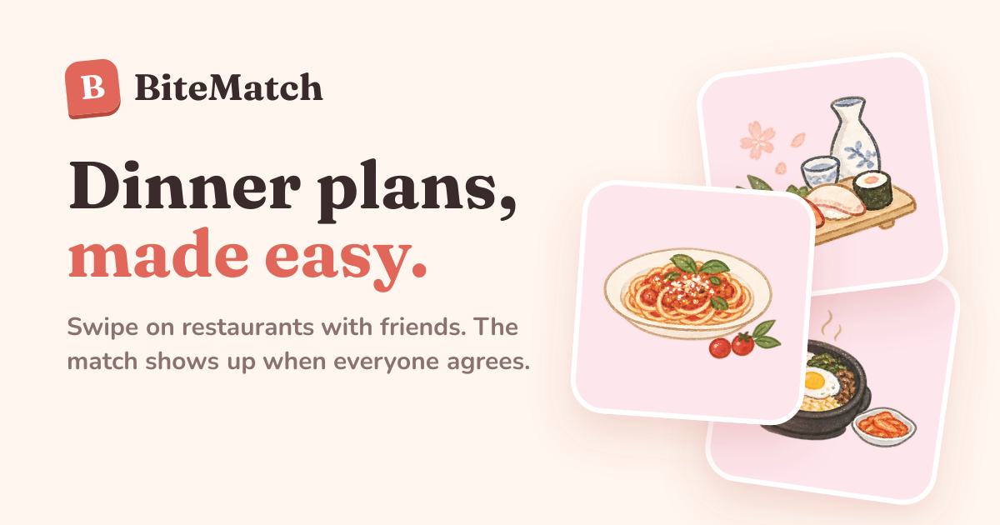
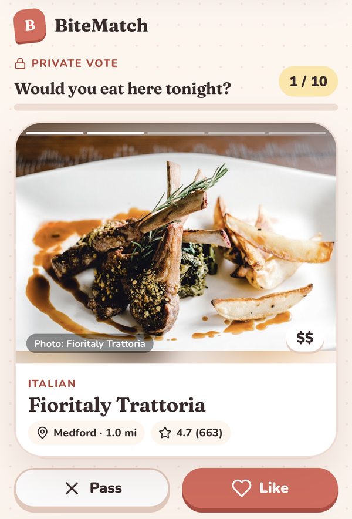
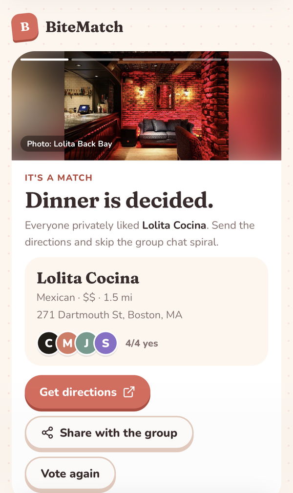
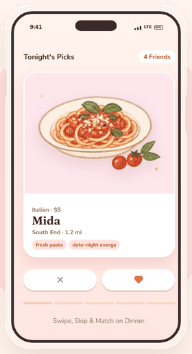

# BiteMatch

**Swipe on restaurants with friends. The match shows up when everyone agrees.**

**Live app: [bite-match-one.vercel.app](https://bite-match-one.vercel.app)**



Picking dinner in a group chat goes in circles: nobody wants to be the one who picks, and the loudest opinion wins. BiteMatch gives everyone a private vote instead. One person makes a room, friends join with a 4-digit code, and everyone swipes through the same short list of real nearby restaurants. When a place gets a yes from everyone, it's a match.

<p align="center">
  
  &nbsp;&nbsp;
  
</p>
<p align="center"><em>A real room on an iPhone: voting with real restaurant photos, then the match.</em></p>

<p align="center">
  
</p>

## How it works

1. **Create a room.** Pick cuisines, a price range and how far you'll go, and share your location for real nearby places.
2. **Invite friends.** Share the link or the 4-digit code. Friends join with just their name, with no accounts.
3. **Vote privately.** Everyone swipes through the same 10 restaurants, flipping through real photos of each one. Other people's votes stay hidden until you've voted on that place, so nobody gets swayed.
4. **Get the match.** As soon as everyone likes the same place, every phone shows it, with confetti. If nobody agrees on everything, the closest call wins once everyone's done, and ties are broken fairly.
5. **Go eat.** Get directions, or share the result back to the group chat.

## Features

- **Live rooms across phones.** Joins and votes sync in real time through Supabase. Refreshing keeps your spot.
- **Real restaurants, real photos.** Nearby places come from Google Places, with up to 5 photos per restaurant you can tap through like stories. OpenStreetMap is the free fallback.
- **Fair picks.** The 10 cards take turns across your chosen cuisines, and places rated 4.0+ with plenty of reviews go first.
- **Voting deadline.** The host can give the room 5 to 30 minutes. If someone hasn't voted by then, the group's top pick wins with the votes in, so one slow friend can't stall everyone.
- **Fair tie-breaks.** If two places tie, the higher rating wins, then more reviews, then the closer one. Every phone shows the same winner and a line explaining why.
- **Swipe, tap or use keys.** Drag the card to vote, tap the photo to flip it, or use the ← → keys on a computer.
- **Fits any screen.** Tested from a 320px iPhone SE up to a desktop monitor.
- **Shareable.** Invite links and results share through the phone's share sheet, with a branded preview card in iMessage, Slack and LinkedIn.
- **Try it alone.** The demo room has simulated friends, so anyone can see the full flow in under a minute.

## Built with

- **Next.js 16** (App Router), **React 19**, **TypeScript**
- **Supabase** (Postgres + Realtime) for rooms, participants and votes
- **Google Places API (New)** for nearby search, ratings, prices and photos
- **OpenStreetMap** (Overpass API) as a free fallback for nearby places
- **Vercel** for hosting
- **Vitest** for tests
- Hand-drawn dish illustrations for the homepage, Fraunces and Nunito type

## Design decisions

- **$0 to run.** Google bills per request, so BiteMatch counts its own usage in the database and stops just under Google's free monthly allowance. Photos are cached for a day, so a whole room shares one load per photo. If the counter can't be checked, it skips Google rather than risk a charge. See [Keeping Google at $0](#keeping-google-at-0).
- **Private by default.** Results for a restaurant unlock only after you vote on it, so early votes can't sway anyone.
- **Small rooms.** Rooms cap at 10 restaurants. Fewer cards means more overlap between friends, so matches come faster.
- **No accounts.** Joining needs only a name and a code. The trade-off is that the code is the only key to a room, which is fine among friends.
- **Graceful fallbacks.** No location or no Google results falls back to OpenStreetMap or the demo list. Photos fall back to a cuisine illustration only when none can be found.

## Run it locally

```bash
npm install
npm run dev
```

Open http://localhost:3000. With no configuration, the app runs in **testing mode**: rooms are saved in your browser only, so two tabs can act as two people, and restaurants come from OpenStreetMap or the demo list.

### Configuration

Copy `.env.example` to `.env.local` and fill in what you need:

| Variable | What it's for |
|---|---|
| `NEXT_PUBLIC_SUPABASE_URL` | Real rooms across phones. Supabase → Connect (or Settings → API Keys). |
| `NEXT_PUBLIC_SUPABASE_ANON_KEY` | The publishable (or legacy anon) key from the same place. |
| `GOOGLE_PLACES_API_KEY` | Real nearby restaurants, ratings and photos. Restrict the key to Places API (New). Keep it secret: it is only used on the server. |

On Vercel, add the same variables under **Settings → Environment Variables**, then redeploy.

### Database setup

In Supabase, open **SQL Editor → New query** and run each file once, in order. All are safe to re-run.

1. `supabase/schema.sql` creates rooms, participants and votes, with live updates turned on.
2. `supabase/usage-cap.sql` creates the usage counter that keeps Google free.
3. `supabase/vote-deadline.sql` makes the database refuse votes after a room's deadline.

## Keeping Google at $0

Google Places has a free monthly allowance per request type. BiteMatch stays under each one:

| Request | Used for | Google's free allowance | BiteMatch's monthly cap |
|---|---|---|---|
| Nearby Search (with ratings) | Finding restaurants for a room | 1,000 | 950 |
| Text Search | Finding photos for demo and OpenStreetMap restaurants | 5,000 | 4,500 |
| Place Photo | Each new photo shown | 1,000 | 950 |

Google also limits nearby searches to 100 a day. Once a cap is reached, rooms use OpenStreetMap and cards show illustrations until the month resets. To check usage, run this in the Supabase SQL Editor:

```sql
select * from api_usage order by day desc, kind;
```

The limits live in `lib/usageCap.ts`.

## Picking the 10 restaurants

`lib/pickRestaurants.ts` chooses each room's list:

- Places rated **4.0+** go first. Review count matters, so a 4.7 with 1,200 reviews beats a 5.0 with 3.
- Selected cuisines **take turns**, so one cuisine can't crowd out the others. If one runs short, the rest fill in.
- Lower-rated places only fill leftover spots.

## Tests

```bash
npm test
```

37 tests cover matching and tie-breaks, voting deadlines, restaurant picking, the demo room's simulated votes, Google data mapping, invite links, the usage cap, and testing-mode rooms.

## Project structure

```
app/
  page.tsx                 Home, room setup and the demo room
  room/page.tsx            Real rooms (invite links: /room?code=1234)
  api/restaurants          Nearby search (Google, then OpenStreetMap)
  api/place-lookup         Finds photos for a restaurant by name and address
  api/place-photo          Serves one Google photo (cached, capped)
  opengraph-image.tsx      Link preview card
components/
  Landing, Setup, Room, LiveRoom, MatchResult
  SwipeDeck                Swipeable card, tap-to-flip photos
  RestaurantPhotos         Real photos, with loading and fallback states
  PhotoCarousel, DishArt, ShareButton
lib/
  matching.ts              Matches, top pick and tie-breaks
  pickRestaurants.ts       Choosing the 10 cards
  googlePlaces.ts          Google + OpenStreetMap search
  usageCap.ts              Monthly caps on Google requests
  rooms/                   Room storage: Supabase, or this browser in testing mode
supabase/                  SQL to set up the database
tests/                     Vitest tests
```

## Credits

Dish illustrations by Cara Huynh. Restaurant photos come from Google Maps contributors and are credited on each photo.
